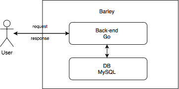

# notifications
Project named “Barley” because its euphony is “大卖”. 

## project description
- for business use who sells products on a social app instead of a shopping app/website.
- provides customer a way to view their purchase history quickly, instead of checking it by looking back our chat history one by one. 
- allows customers to track the package easily.
- to lower down the operating cost, customers do not need to register an account.
- send a unique link to customers, which will lead to a webpage containing all info customers concerned.



## features
admin
- admin login
- admin creates user account
- admin create shipping information (general product description)
- admin can trigger shipping notification by sms (copy msg by one-click)

user
- user check shipping history

## plans
### frontend user
- list shipping history page filter, sort 
- list shipping history page - action button - redirect to tracking website

### frontend admin
- admin login 
- admin creates user account
- list shipping history page filter, sort 
- list shipping history page - action button

### database
- design schema
- shipment: 
```
DROP TABLE IF EXISTS `shipment`;
CREATE TABLE `shipment` (
    `ID` int(6) unsigned NOT NULL AUTO_INCREMENT,
    `UserID` int(6) NOT NULL,
    `Description` varchar(64),
    `Tracking` varchar(16) NOT NULL,
    `Comment` varchar(255),
    `Date` varchar(16) NOT NULL,
    PRIMARY KEY (`id`)
) ENGINE=InnoDB AUTO_INCREMENT=1 DEFAULT CHARSET=latin1;
INSERT INTO shipment (id, UserID, Description, Tracking, `Comment`, Date) VALUES(1, 1, "purchased 1* skin care on 12/01", "Udex111111", "Carried by Udex in Canada, will be transferred to Yunda in China", "2021-12-01");
INSERT INTO shipment (id, UserID, Description, Tracking, `Comment`, Date) VALUES(2, 2, "purchased 2* skin care on 12/02", "Udex222222", "Carried by Udex in Canada, will be transferred to Yunda in China", "2021-12-02");
INSERT INTO shipment (id, UserID, Description, Tracking, `Comment`, Date) VALUES(3, 3, "purchased 3* skin care on 12/03", "Udex333333", "Carried by Udex in Canada, will be transferred to Yunda in China", "2021-12-03");
INSERT INTO shipment (id, UserID, Description, Tracking, `Comment`, Date) VALUES(4, 4, "purchased 4* skin care on 12/04", "Udex444444", "Carried by Udex in Canada, will be transferred to Yunda in China", "2021-12-04");
INSERT INTO shipment (id, UserID, Description, Tracking, `Comment`, Date) VALUES(5, 5, "purchased 5* skin care on 12/05", "Udex555555", "Carried by Udex in Canada, will be transferred to Yunda in China", "2021-12-05");
```
- user:
```
DROP TABLE IF EXISTS `user`;
CREATE TABLE `user` (
    `ID` int(6) unsigned NOT NULL AUTO_INCREMENT,
    `WeChatID` varchar(64) NOT NULL,
    `WeChatName` varchar(255),
    `RandomCode` varchar(16) NOT NULL,
    PRIMARY KEY (`id`)
) ENGINE=InnoDB AUTO_INCREMENT=1 DEFAULT CHARSET=latin1;
INSERT INTO `user` (id, WeChatID, WeChatName, RandomCode) VALUES(1, "1test", "1testname", "RandomCode1");
INSERT INTO `user` (id, WeChatID, WeChatName, RandomCode) VALUES(2, "2test", "2testname", "RandomCode2");
INSERT INTO `user` (id, WeChatID, WeChatName, RandomCode) VALUES(3, "3test", "3testname", "RandomCode3");
```
- Admin: (We don't want to make a complicated authorization, so I didn't add the func to encode the password)
```
DROP TABLE IF EXISTS `admin`;
CREATE TABLE `admin` (
    `ID` int(6) unsigned NOT NULL AUTO_INCREMENT,
    `Name` varchar(16) NOT NULL,
    `Password` varchar(255) NOT NULL,
    PRIMARY KEY (`id`)
) ENGINE=InnoDB AUTO_INCREMENT=1 DEFAULT CHARSET=latin1;
INSERT INTO `admin` (id, Name, Password) VALUES(1, "GentleDonkey", "$2a$08$pxJjMZq/gWgsXmbxqqqn/ezM6OBmhnkJ29oP15t.fv9fet7LVdUSm");
```
- (Plaintext password for admin "GentleDonkey" is "barley", encode rounds 8)
### api
#### user
- GET /api/v1/user/tracking/{code} (to view all shipments)
#### admin
- POST /api/v1/admin/shipment (to create a new shipment)
- GET /api/v1/admin/shipment (to view all shipments)
- GET /api/v1/admin/shipments/{id} (to view one shipment)
- DELETE /api/v1/admin/shipments/{id} (to delete one shipment)
- PATCH /api/v1/admin/shipments/{id} (to update one shipment)
- GET /api/v1/admin/users (to view all users)
- POST /api/v1/admin/user (to create a new user)
- POST /api/v1/admin/login (to login to admin account)

### lib
#### ant design pro
- https://pro.ant.design/
#### rest api
- https://github.com/gorilla/mux
- example
- https://medium.com/the-andela-way/build-a-restful-json-api-with-golang-85a83420c9da
- https://hugo-johnsson.medium.com/rest-api-with-golang-mux-mysql-c5915347fa5b
#### mysql golang driver 
- https://github.com/go-sql-driver/mysql
- example
- https://www.golangprograms.com/example-of-golang-crud-using-mysql-from-scratch.html
#### convert payload to json format
- https://www.sohamkamani.com/golang/json/
#### rest api documentation
- https://editor.swagger.io
- https://swagger.io/docs/specification/2-0/basic-structure/
- https://medium.com/@amirm.lavasani/restful-apis-tutorial-of-openapi-specification-eeada0e3901d
#### docker
- https://labs.play-with-docker.com
- https://www.docker.com/101-tutorial
- https://hub.docker.com/repository/docker/gentledonkey/101-todo-app
- https://redis.io
#### Password verification
- https://github.com/golang/crypto
- https://pkg.go.dev/golang.org/x/crypto/bcrypt
- https://www.jisuan.mobi/p163u3BN66Hm6JWx.html
#### Authorization
- https://www.sohamkamani.com/golang/jwt-authentication/
- https://sherryhsu.medium.com/session-vs-token-based-authentication-11a6c5ac45e4
- https://github.com/golang-jwt/jwt/blob/main/README.md
#### Refactor
- https://gorm.io/zh_CN/docs/sql_builder.html
- https://github.com/golang-standards/project-layout
- https://threedots.tech/post/repository-pattern-in-go/
- https://medium.com/golang-issue/how-singleton-pattern-works-with-golang-2fdd61cd5a7f
#### redis
- https://try.redis.io/
#### config setting
- https://github.com/spf13/viper
#### test
- https://github.com/stretchr/testify
- https://github.com/mitchellh/mapstructure
- https://medium.com/nerd-for-tech/testing-rest-api-in-go-with-testify-and-mockery-c31ea2cc88f9
#### nodemon
- https://dev.to/rezvitsky/nodemon-go-app-2p7f

